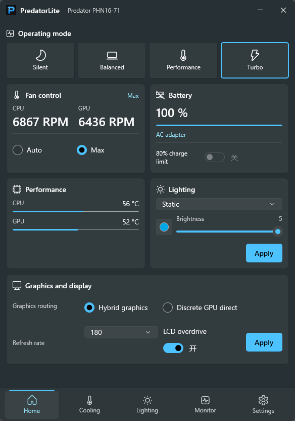

<p align="right">
  <b>English</b> | <a href="README.zh-CN.md">简体中文</a>
</p>

<p align="center">
  
</p>

# PredatorLite

[](https://github.com/XYZ1024-alt/PredatorLite/actions/workflows/build.yml)
[](LICENSE)

PredatorLite is an independent, unofficial PredatorSense alternative for Acer Predator devices. It provides performance, thermals, lighting, GPU routing, battery, and telemetry control with standard user privileges, and gates hardware writes behind explicit hardware profiles.
PredatorLite is an independent, unofficial PredatorSense alternative for Acer Predator devices. It provides performance, thermals, lighting, GPU routing, battery, and telemetry control with standard user privileges.

The app is fully tested on:

- Acer Predator PHN16-71
- BIOS V1.20
- Windows 11 24H2 (build 26100+) x64

Other Acer Predator models and BIOS versions are supported too. Because the Acer service interfaces can differ slightly between models and BIOS versions, a specific feature may behave inconsistently on hardware that has not been tested yet. If you hit anything unexpected, open an issue with your model, BIOS version, and a diagnostic export so it can be looked into.

PredatorLite is an independent, unofficial PredatorSense alternative and does not represent an official Acer product or endorsement. Hardware control carries some inherent risk, so review the [hardware safety boundaries](docs/hardware-safety.md) before use. On first run of a new release, Windows may show a SmartScreen reputation prompt.

## Features

- Quiet, Balanced, Performance, Turbo, and Eco operating modes
- Automatic, Full Speed, and custom fan control with temperature curves
- Hybrid graphics / Discrete GPU switching with an explicit restart prompt
- Display refresh rate, LCD response-time acceleration, and 80% charge limit
- Four-zone static keyboard backlight, dynamic lighting effects, and chassis logo light
- Device toggles: Windows key, sticky-key shortcuts, startup sound, and keyboard backlight timeout
- CPU/GPU, fan, memory, VRAM, battery, and performance floating-window monitoring
- System tray, single instance, bilingual UI (Simplified Chinese/English), optional OSD, and global hotkeys
- Auto-docks to the bottom-right corner of the monitor containing the cursor whenever summoned, and takes over dedicated PredatorSense keys while running
- Acer service status, conflicting-service backup/disable/restore, and redacted diagnostics bundles

PredatorLite does not provide user overclocking, voltage adjustment, power-limit modification, MSR/NVAPI writes, BIOS writes, or vBIOS tooling.

## Safety Model

- Only the last saved operating mode is automatically restored at each main-instance startup; fan, lighting, GPU routing, and other hardware settings are never replayed.
- Every write originates from an explicit user action, power-state automation the user explicitly enabled, or the operating-mode startup restore above.
- Writes open only after a successful backend capability probe; a model or BIOS version that has not been tested may expose slight differences in individual controls.
- Result read-back is performed where endpoints support querying; a failed multi-step operation is never misreported as fully successful when only partially so.
- GPU routing supports only `Hybrid = 2` and `Discrete = 1`; there is no iGPU-only path and no path that disables Windows display adapters.
- Enabling Full Speed or custom fan mode requires launching the independent FanGuard first. If the main app loses contact for 5 seconds or exits abnormally, FanGuard restores EC automatic fan control.
- The main app runs with standard user privileges. An elevated helper with a fixed command allowlist runs only to disable or restore conflicting services.

See [architecture](docs/architecture.md) and [hardware safety boundaries](docs/hardware-safety.md) for details.

## Dependencies

PredatorLite reuses interfaces provided by Acer's official drivers and services; it does not bundle or replace firmware:

- `AcerServiceSvc`: operating modes, fans, GPU routing, and some device settings
- `AcerLightingService`: keyboard and logo lighting
- `AcerApplicationBaseDriver_Device`: Acer WMI/hardware bridge driver
- `AcerQAAgentSvis`: optional; used only for the physical performance-mode key notification. The PredatorSense launcher key uses a dedicated keyboard listener

The app never disables the required components above. The settings page can only manage PredatorSense conflicting services identified by a fixed allowlist, and stores startup-mode backups in `%ProgramData%\PredatorLite\service-backup.json`.

Some Acer WMI methods may be rejected by the current driver ACL. PredatorLite then keeps standard user privileges and never requests elevation for telemetry polling; WMI-only CPU temperature, fan speed, charge limit, or keyboard backlight timeout are shown as unavailable. When a custom fan curve encounters missing temperatures, it treats them as 95°C and uses 100% speed rather than silently falling back to a low speed.

## Distribution

PredatorLite has two alternative distribution channels:

- **GitHub** publishes Beta, RC, and Stable portable ZIP and Inno Setup EXE assets. Stable GitHub builds retain the manual in-app update check and verified Setup download.
- **Microsoft Store** publishes Stable MSIX packages only. Store builds remove the in-app update check, release-notes action, installer downloader, and elevated conflicting-service management; Microsoft Store supplies updates automatically. FanGuard remains packaged for Max and Custom fan safety.

Each Stable workflow builds both channels from the same `Directory.Build.props` version and source commit. Store certification can take up to three business days, so the matching GitHub Release and Store listing do not need to become public at the same minute. The channels are not designed to run simultaneously, and settings are not guaranteed to migrate or be shared between them.

See the [privacy policy](PRIVACY.md) and [Microsoft Store submission guide](docs/store-submission.md).

## Building

Requires native x64 Windows 11 24H2 (build 26100+) and the .NET SDK 10.0.302 pinned by `global.json`. All Windows projects target `net10.0-windows10.0.26100.0`, and the UI uses stable Microsoft Windows App SDK 2.3.1:

```powershell
dotnet restore PredatorLite.slnx
dotnet build PredatorLite.slnx -c Release --no-restore
dotnet test PredatorLite.slnx -c Release --no-build
$env:Configuration = "Release"
dotnet format PredatorLite.slnx --verify-no-changes --no-restore
```

Run the UI from source:

```powershell
dotnet run --project src\PredatorLite.App\PredatorLite.App.csproj
```

Framework-dependent ReadyToRun publish:

```powershell
.\build\publish.ps1
```

Output goes to `publish\win-x64`, containing the main app, FanGuard, and the elevated helper. This is a portable, framework-dependent, x64 directory publish; it does not use MSIX. Target machines need both:

- .NET 10 Runtime x64
- Windows App Runtime 2.3 x64

The publish directory must be kept intact — copying only `PredatorLite.exe` is not enough. The publish script publishes the main app, FanGuard, and ElevatedHelper separately, then merges the files each owns; by default it produces the measured, validated balanced framework-dependent ReadyToRun layout: startup-critical assemblies stay R2R while deferred telemetry and unused AI/ML/Widgets managed projections remain IL. The script rejects non-AMD64 native PEs, 32-bit managed assemblies, ARM/x86 subdirectories, TraceEvent leftovers, and Windows ML native runtimes that must not be carried locally in a framework-dependent layout, and enforces an 80 MiB R2R budget. `Directory.Build.props` holds the three-part base version; the publish script generates `1.0.1-beta.1`, `1.0.1-rc.1`, or `1.0.1` from the `Beta`, `RC`, or `Stable` channel. Use `build/publish.ps1 -ReadyToRun:$false` for an IL comparison layout with a 65 MiB budget; release assets always use the validated ReadyToRun layout.

Build Stable, RC, or Beta release assets locally:

```powershell
.\build\prepare-release.ps1 -Version 1.1.0 -Channel Stable
.\build\prepare-release.ps1 -Version 1.1.0 -Channel RC -Iteration 1
.\build\prepare-release.ps1 -Version 1.1.0 -Channel Beta -Iteration 1
```

The script produces four assets for the given version in `publish\release`. For RC 1:

- `PredatorLite-1.1.0-rc.1-win-x64-portable.zip`
- `PredatorLite-1.1.0-rc.1-win-x64-portable.zip.sha256`
- `PredatorLite-Setup-1.1.0-rc.1-win-x64.exe`
- `PredatorLite-Setup-1.1.0-rc.1-win-x64.exe.sha256`

Release assets use the framework-dependent ReadyToRun portable directory and a standard-user installer. Target machines need .NET 10 Runtime x64, Windows App Runtime 2.3 x64, and native x64 Windows 11 24H2 (build 26100+). Windows may show a SmartScreen reputation prompt on first run of a new release; verify assets with the corresponding `.sha256` file both before and after release.

Inno Setup local installer test package:

```powershell
.\build\build-installer.ps1 -SkipSigning
```

Output: `artifacts\installer\unsigned\PredatorLite-Setup-1.1.0-win-x64-unsigned.exe`. Internal test payloads and packages live in the ignored `artifacts` directory and never read or write `publish`; that path is used only by signing gates and is not a release entry point. Public-repository Actions artifacts cannot serve as an internal distribution channel, so the `build` workflow only verifies the build and the RC installer without uploading downloadable artifacts.

`.github\workflows\release.yml` runs only manually from the Actions page and requires choosing a channel:

- `beta`: `iteration` is required and `confirm_public` must stay `false`; creates a Draft Pre-release visible only to users with push access to the repository.
- `rc`: `iteration` is required and `confirm_public` must be checked; creates a public GitHub Pre-release.
- `stable`: `iteration` must be empty and `confirm_public` must be checked; creates a regular GitHub Release.

The workflow only accepts `main` and never overwrites an existing complete version. Beta is for maintainer-internal testing; if testers should not get push access to the public repository, distribute Beta through a separate private repository or private storage.

Full temporary-certificate signing, install, uninstall, and timestamp integration tests do not block everyday builds. Run `build\test-installer-signing.ps1` locally before release; to check on a GitHub-hosted environment, run the `installer signing gates` workflow manually from the Actions page. That manual workflow uploads no artifacts and cannot create or modify GitHub Releases; its `-test-signed` output exists only on the temporary runner and is deleted when the test finishes.

Optional certificate-signed builds require an Authenticode certificate with a private key and Code Signing EKU, issued by a publicly trusted CA, imported into `CurrentUser\My`, with its chain root present in the Windows `LocalMachine\AuthRoot` store; then run:

```powershell
$env:PREDATORLITE_SIGNING_THUMBPRINT = "<certificate SHA-1 thumbprint>"
.\build\build-installer.ps1
```

Certificate-signed builds never modify `publish\win-x64`. Each invocation signs the 8 PredatorLite-owned EXE/DLLs in its own `artifacts` working directory, then verifies SHA-256 signatures and RFC 3161 timestamps with SignTool pinned to the expected certificate; Inno Setup signs both Setup and the embedded uninstaller, and the test script verifies the uninstaller after installation. Only after Setup verification and `.sha256` generation all succeed does the script promote both files into `publish\installer` via same-parent-directory moves. A failure before promotion preserves existing release installers; a failure after promotion starts deletes the candidates and incomplete targets. The build fails on self-signed certificates, certificates trusted only by a private local root, revoked certificates, missing private keys, wrong EKU, or expired certificates. Third-party DLLs keep their original publisher signatures and are never re-signed by PredatorLite.

## Project Structure

```text
src/PredatorLite.App              WinUI 3 UI, tray, OSD, and app orchestration
src/PredatorLite.Core             Models, interfaces, settings, and fan-curve safety logic
src/PredatorLite.Platform.Windows AcerService, WMI, and Windows read-only monitoring
src/PredatorLite.FanGuard         Fan failure-recovery watchdog
src/PredatorLite.ElevatedHelper   Fixed-allowlist service management helper
src/PredatorLite.Package          Microsoft Store WAP/MSIX packaging project
tests/PredatorLite.Tests          Protocol, curve, settings, and capability-boundary tests
benchmarks/PredatorLite.Benchmarks Packet codec, curve, and telemetry microbenchmarks
```

## Provenance Boundaries

PredatorLite is an independently implemented interoperability project and does not distribute Acer source code, decompiled code, drivers, firmware, ROMs, or vendor assets. Fixed protocol values, validation methodology, and contribution requirements are documented in the [protocol provenance](docs/protocol-provenance.md). Locally ignored research directories are not part of the project or Git history and cannot serve as a source for contributed code or assets.

PredatorLite is not an official Acer product and is not affiliated with Acer. The Acer, Predator, and PredatorSense names are used only to describe compatibility.

The full pre-release checklist lives in the [manual testing](docs/manual-testing.md) document.

## Contributing & Security

Please read the [contribution guide](CONTRIBUTING.md) before submitting code. Report security issues privately per the [security policy](SECURITY.md); do not disclose vulnerabilities, machine keys, or unredacted diagnostics in public issues. Data handling is documented in the [privacy policy](PRIVACY.md).

## License

PredatorLite source code and original project assets are licensed under the [MIT License](LICENSE). Asset scope is described in [ASSET-LICENSE.md](ASSET-LICENSE.md); dependent components and their licenses are listed in [THIRD-PARTY-NOTICES.md](THIRD-PARTY-NOTICES.md).
